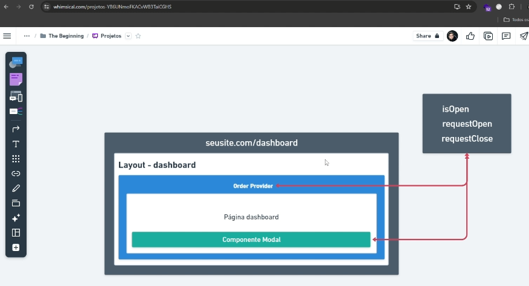

## Iniciar projeto

$ npx create-next-app@13.4.12 pizzaria-frontend
Need to install the following packages:
create-next-app@13.4.12
Ok to proceed? (y) y

√ Would you like to use TypeScript? ... No / Yes
√ Would you like to use ESLint? ... No / Yes
√ Would you like to use Tailwind CSS? ... No / Yes
√ Would you like to use `src/` directory? ... No / Yes
√ Would you like to use App Router? (recommended) ... No / Yes
√ Would you like to customize the default import alias? ... No / Yes
√ What import alias would you like configured? ... @/*
Creating a new Next.js app in C:\Cursos\Udemy\pizzaria\pizzaria-frontend.

## Sass

npm install sass

Instalar as extenções no VS Code

css modules
Ajudará no auto complete do css e sass

Sass (.sass only)

## Axios

Para fazer requisições http

npm install axios

##

Deixa pegar o cookie no client side (arquivo cookieClient.ts)

npm install cookies-next

## Lucide react
Biblioteca de ícones 

npm install lucide-react

# Um componente não precisa de "export default" somente quando é uma página é preciso adicionar o "export default" segundo a documentação do nextjs

## ✘ node v20.18.0 is not yet supported in the Community edition of Console Ninja.

Esse erro está ocorrendo porque você está usando o Node.js na versão 20.18.0, que aparentemente não é suportada pelo Console Ninja na edição Community.

Para resolver isso, instalar v18.17.0 is required
https://nodejs.org/pt/blog/release/v18.17.0

## Sonner

Toast component para o react. Só é possível utilizar dentro de funções do tipo client. Não é possível utilizar em funções do tipo server-side

npm install sonner

\src\app\layout.tsx

--
Por padrão a página (page.tsx) é server-side
Se utilizado o "use-client" é considerado client-side

## Provider

